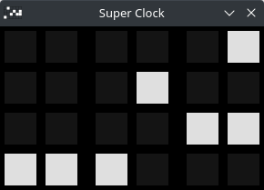

# Super Clock
A Binary Clock with Hours, Minutes and Seconds. with 2 Styles and 3 Layouts. The time can temporarily be shown in the Window Title.

# Controls
Escape - Closes the clock.\
T/Space - Display the time in Window Title.\
S - Changes the clock style.\
F - Prints the FPS to the console.

# Ports
[C - SDL2](C-SDL2)
